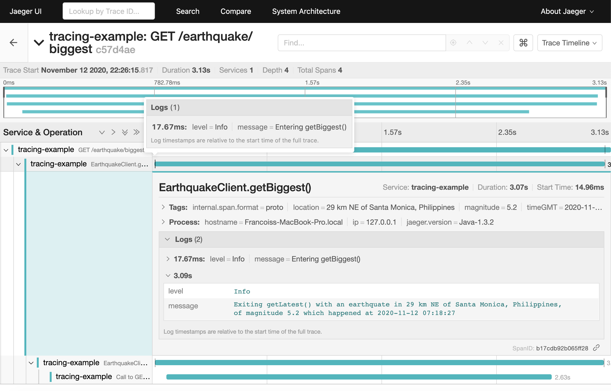

## Earthquake API - Example app using kotlin-logging-opentracing-decorator

Example Ktor application instrumented with OpenTracing using [ktor-opentracing](https://github.com/zopaUK/ktor-opentracing), using [kotlin-logging](https://github.com/MicroUtils/kotlin-logging) for logging and [kotlin-logging-opentracing-decorator](https://github.com/fstien/kotlin-logging-opentracing-decorator) to write logs to spans. 

Retrieves data about earthquakes that happened today using an [API from the U.S. Geological Survey](https://earthquake.usgs.gov/fdsnws/event/1/). 

### Running

1. Start an [all-in-one Jaeger backend](https://www.jaegertracing.io/docs/1.20/getting-started/) with in-memory storage.

        docker run -d --name jaeger \
          -e COLLECTOR_ZIPKIN_HTTP_PORT=9411 \
          -p 5775:5775/udp \
          -p 6831:6831/udp \
          -p 6832:6832/udp \
          -p 5778:5778 \
          -p 16686:16686 \
          -p 14268:14268 \
          -p 14250:14250 \
          -p 9411:9411 \
          jaegertracing/all-in-one:1.20
             
2. Start the application.

        ./gradlew run
        
3. Send some requests. Other routes available are `/earthquake/biggest` and `/earthquake/biggerthan/5` (where 5 is a parameter).

        curl localhost:8080/earthquake/latest
        {
          "location" : "21 km SSE of Karluk, Alaska",
          "magnitude" : 1.9,
          "timeGMT" : "2020-11-02 09:46:39"
        }  
        
4. See traces in Jaeger.

    http://localhost:16686/




5. Stop the Jaeger docker container.

        docker ps
        docker stop <containerId>

### Steps

1. Import the `kotlin-logging-opentracing-decorator` dependency. ([Commit](https://github.com/fstien/kotlin-logging-opentracing-decorator-example/commit/4c96d82155659b1e755cc11b47f990eef1d61adb)).
    ```
    implementation 'com.github.fstien:kotlin-logging-opentracing-decorator:0.1.0'
    ```
2. Call the `withOpenTracingLogs` extension function on your loggers. ([Commit](https://github.com/fstien/kotlin-logging-opentracing-decorator-example/commit/db69e50720d95c4d887358bca5e1887736d28552)).

    ```kotlin
    val logger = KotlinLogging.logger {}.withOpenTracingLogs()
    ```
